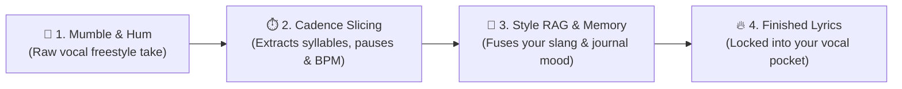
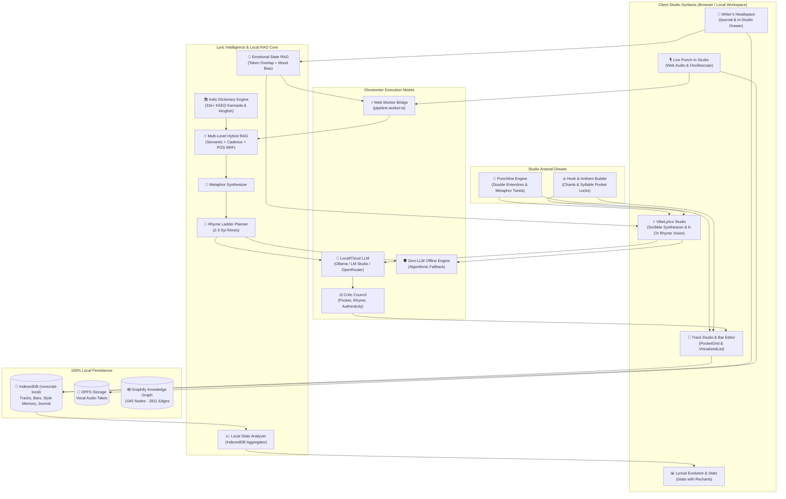

# VibeVox

<p align="center">
  
  
  
  
  
  
  
</p>

An open-source, local-first studio workspace for vocalists, songwriters, and producers. **VibeVox** turns **raw vocal mumbles, hummed melodies, and freestyles** into Drake/Kendrick-tier polished lyrics, maps audio cadences in real-time, powers multi-level artistic RAG, and tracks your lyrical evolution—all running **100% offline** on your machine with zero cloud lock-in.

> **💡 The Hitmaker Secret:** Every major artist starts by humming or mumbling a melody into their phone. **VibeVox** captures that raw vocal take, extracts your exact cadence and syllable rhythm, and writes hit-ready lyrics that lock directly into your vocal pocket.

---

## 🎙️ The Flagship Superpower: Vocal Mumbling to Polished Lyrics

Most lyricists don't start with a blank page; they start with a **vocal melody or rhythm pocket**. VibeVox automates the journey from spontaneous vocal sketch to radio-ready song:



### The Mumble-to-Masterpiece Workflow:
1. **Hum or Mumble Freely:** Hit record in the **Live Punch-In Studio** or **New Track Wizard**. Mumble gibberish, hum the flow, or drop loose words (`"mhm da-da-dum in the night... mm yeah tryna get the bag right..."`).
2. **Real-Time Cadence Extraction:** The local audio pipeline runs through latency-compensated bar slicing and Whisper STT to calculate the exact syllable count per bar, stress envelope (`/` vs `x`), and breath caesuras.
3. **Ghostwriter Pocket Locking:** The AI Ghostwriter (or Zero-LLM POS engine) takes the extracted syllable envelope and replaces the mumble with authentic, hard-hitting lyrics that match your vocal cadence note-for-note.

| Raw Vocal Mumble Take | VibeVox Synthesized Studio Bar | Cadence Pocket |
|---|---|---|
| *"mhm da-da-dum in the backseat... mm yeah..."* | *"Heavy bass humming in the backseat, neon on the glass"* | 14 Syllables · Locked |
| *"da-da running from the clock man... no cap..."* | *"Racing every minute till the shadow of the past has passed"* | 14 Syllables · Locked |

---

## 💡 Inspiration: VoxSketch AI & VibeLyrics

**VibeVox** merges two powerful paradigms:
1. **[VoxSketch AI](https://voxsketch.com/)**: Turning raw vocal mumble recordings and spontaneous freestyles into structured, cadence-matched song lyrics.
2. **VibeLyrics**: Advanced rap analytics, private emotional headspace RAG journaling, intelligent punchline/double-entendre generation, and anthemic hook synthesis.

While cloud-based tools rely on remote APIs and monthly credits, **VibeVox** brings this complete workflow to your device as a **100% local-first application**. Your recordings, private diary reflections, and lyrical style memories never leave your machine.

---

## ✨ Features & Studio Superpowers

### 1. 🎙️ Vocal Mumble-to-Lyrics Conversion & Cadence Mapping
- **Mumble-to-Bar Synthesis**: Hum a melody, mumble gibberish rhythms, or drop spontaneous flows. VibeVox extracts the rhythmic envelope and writes hit-tier lyrics matching your voice.
- **Latency-Compensated Bar Slicing**: Record vocal takes bar-by-bar with automatic delay compensation and sub-millisecond audio alignment.
- **Live Punch-In Studio**: Web Audio oscilloscope waveform visualizer, tempo metronome pulse ring, and OPFS audio persistence.

### 2. ⚡ VibeLyrics Studio & Flagship 4-Superpowers
- **Scribble-to-Song Synthesizer**: Paste fragments, ideas, or half-baked punchlines. Select a structure mode (*Full Song*, *16-Bar Verse*, *Hook Anthem*, *Rhyme Couplets*) to instantly generate structured, cadence-locked song blueprints.
- **6-Channel Phonetic Rhyme Vision**: Real-time phoneme clustering coloring assonance, consonants, and compound family rhymes directly as you type.
- **Matra Prosody & Stress Matrix**: Indian classical Matra counting alongside English metrical foot stress analysis (`/` stressed, `x` unstressed) for precise cadence pocket locking.
- **Auto-Sync to Brain Memory**: 1-click or automatic background sync of your best written bars into your local artist style memory.

### 3. 📓 Writer's Headspace (Private Emotional State RAG)
- **100% Local-First IndexedDB Journal**: Private diary capturing raw emotions, late-night reflections, and unfiltered thoughts (*Raw, Introspective, Aggressive, Melancholic, Triumphant, Late Night*).
- **Semantic RAG Ingestion**: Automatically retrieves relevant diary thoughts matching your track's mood and theme, feeding real-life emotion into the AI ghostwriter without cliché imitation.
- **In-Studio Headspace Drawer**: Slide-out drawer accessible directly inside the lyrics editor and scribble pad to jot thoughts or drop reflections into active bars.

### 4. 🎯 Studio Arsenal: Punchlines & Hooks
- **Punchline & Double Entendre Engine**: Scores punchline potential (0–100 pts) based on contrast keywords, wordplay, reversals, and alliteration. Dual-engine: uses active LLM with zero-LLM algorithmic fallback (rhymes + sensory metaphors).
- **Hook & Anthem Builder**: Crafts catchy 2-to-4-line choruses, trap pockets, and chants with matching syllable counts per line.
- **Unified Slide-Over Drawer**: 1-click copy or direct insertion into the active writing pad.

### 5. 📊 Lyrical Evolution & Stats Dashboard (`/stats`)
- **Cadence Pocket Distribution**: Interactive **Recharts** bar chart showing syllable frequencies (6 to 18 syllables/bar).
- **Session Progression**: Area chart displaying bar volume and pacing over time.
- **Vocabulary Diversity Ratio**: Tracks unique word percentage and vocabulary expansion.
- **Dominant Rhyme Sound Families**: Detects recurring phonetic anchors (`/aɪ/`, `/eː/`, etc.).
- **Writing Activity Streak**: Tracks consecutive studio days.

### 6. 🧠 Artistic Ghostwriter & Multi-Level Hybrid RAG
- **Reciprocal Rank Fusion ($RRF$)**: Combines vector cosine similarity, cadence density matching, and POS grammar scoring.
- **Zero-LLM Offline RAG Mode**: Even with no LLM connected, assembles rhythmic lines using POS grammars, style memory, and phonetics.
- **Critic Council**: Multi-critic evaluation of pocket rhythm, wordplay quality, and authenticity.

---

## 🏗️ End-to-End System Architecture



---

## 📁 Codebase Structure & Directory Layout

```
VibeVox
├── graphify-out/                       # Graphify Knowledge Graph (HTML, JSON, Report)
│   ├── graph.html                      # Interactive D3/WebGL architecture visualizer
│   ├── graph.json                      # GraphRAG-ready graph dataset
│   ├── GRAPH_REPORT.md                 # Complete god nodes & community report
│   └── update_graph.py                 # Fast AST rebuild script
├── public/
│   ├── data/                           # Dictionaries (KEED 2018 Kannada, Hinglish rap)
│   └── screenshots/                    # Studio tour image assets
├── scripts/
│   └── build_dictionary_datasets.py    # Dictionary dataset compiler
├── src/
│   ├── components/                     # Modular Studio Components
│   │   ├── connect/                    # Barrel: LlmScanPanel, WhisperScanPanel
│   │   ├── journal/                    # Barrel: JournalDrawer
│   │   ├── scribble/                   # Barrel: SuperpowersBanner, ScribbleResultView
│   │   ├── settings/                   # Barrel: StyleTrainingPanel, StyleMemoryPanel
│   │   ├── studio-arsenal/             # Barrel: StudioArsenalDrawer (Punchlines & Hooks)
│   │   ├── track/                      # Barrel: BarRow, TrackToolbar, TrackScorecard, etc.
│   │   ├── NotificationCenter.tsx      # Real-time pipeline progress drawer
│   │   ├── PocketGrid.tsx              # Syllable cadence grid & rhyme scheme tagging
│   │   └── RhymeLookup.tsx             # Datamuse & CMUdict rhyme explorer
│   ├── hooks/                          # useShortcuts, useNotifications, useMobile
│   ├── lib/                            # Core Algorithms & Local Intelligence
│   │   ├── __tests__/                  # 23 Vitest test suites (149/149 passing)
│   │   │   ├── arsenal-and-stats.test.ts # Punchlines, hooks, and stats tests
│   │   │   ├── journal.test.ts         # Journal storage and RAG recall tests
│   │   │   ├── scribble-synthesizer.test.ts
│   │   │   ├── cadence-flow.test.ts
│   │   │   ├── dhh-technicalities.test.ts
│   │   │   └── style-memory.merge.test.ts
│   │   ├── cadence-flow.ts             # Matra calculation & stress pattern analysis
│   │   ├── cmudict-rhymes.ts           # Offline CMU phonetic dictionary
│   │   ├── hook-engine.ts              # Anthemic chorus & chant builder
│   │   ├── journal-rag.ts              # Emotional state journal RAG retriever
│   │   ├── local-pipeline.ts           # Ghostwriter prompt building & multi-pass generation
│   │   ├── local-store.ts              # IndexedDB database (tracks, bars, journal) & OPFS
│   │   ├── punchline-engine.ts         # Wordplay, contrast, and double-entendre engine
│   │   ├── stats-analyzer.ts           # Local stats aggregation & evolution engine
│   │   ├── style-memory.ts             # Persona & style memory store
│   │   └── scribble-synthesizer.ts     # Scribble-to-song synthesis engine
│   └── routes/                         # TanStack Start File-Based Routes
│       ├── __root.tsx                  # Root shell & SSR HTML metadata
│       ├── _app.tsx                    # Shell layout with sticky nav & connection pill
│       ├── _app/
│       │   ├── library.tsx             # /library — Track library & bundle import/export
│       │   ├── scribble.tsx            # /scribble — VibeLyrics studio & superpowers
│       │   ├── journal.tsx             # /journal — Writer's Headspace & emotional diary
│       │   ├── stats.tsx               # /stats — Lyrical Evolution & Stats dashboard
│       │   ├── brain.tsx               # /brain — Local style memory & vector indexer
│       │   ├── references.tsx          # /references — Cadence fingerprints & references
│       │   ├── connect.tsx             # /connect — Local & cloud LLM/STT connection hub
│       │   ├── settings.tsx            # /settings — Audio calibration, OPFS & cache
│       │   ├── live.tsx                # /live — Real-time punch-in studio
│       │   └── track.$id.tsx           # /track/:id — Deep studio lyric editor & arsenal
│       ├── index.tsx                   # / — Landing page
│       └── onboarding.tsx              # /onboarding — First-time setup wizard
├── AGENTS.md                           # Comprehensive agent & IDE guide
└── README.md
```

---

## 🚀 Quickstart

```bash
# 1. Install dependencies
bun install   # or: npm install

# 2. Start development server (http://localhost:8080)
bun dev       # or: npm run dev

# 3. Run full unit test suite (149 tests across 23 files)
npx vitest run

# 4. Production build
npm run build
```

---

## 🕸️ Knowledge Graph (Graphify)

The entire codebase is indexed into a persistent, queryable knowledge graph powered by **Graphify**:
- **Interactive Visualization**: Open `graphify-out/graph.html` in your browser for an interactive D3 graph of all 1,045 nodes and 2,811 cross-module edges.
- **Architectural Report**: See [`graphify-out/GRAPH_REPORT.md`](graphify-out/GRAPH_REPORT.md) for community detection breakdowns, cohesion metrics, and god nodes.
- **Fast AST Update**: Rebuild the graph anytime in ~7s using:
  ```powershell
  & (Get-Content graphify-out\.graphify_python) graphify-out\update_graph.py
  ```

---

## 📄 License & Acknowledgments

- **License**: Released under the **MIT License**.
- **Special Thanks**: Inspired by **[VoxSketch AI](https://voxsketch.com/)** and the **VibeLyrics** lyrical intelligence ecosystem.
- **Phonetics & Lexicons**: Powered by KEED 2018 Kannada-English Dictionary, Hinglish rap dataset, CMUdict, Datamuse, and RhymeWave.
