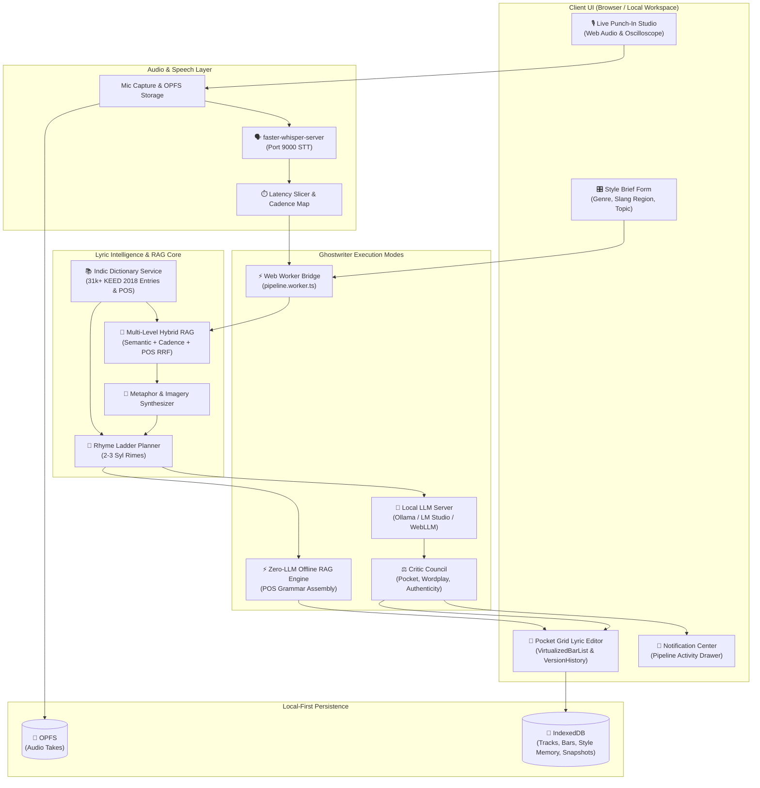
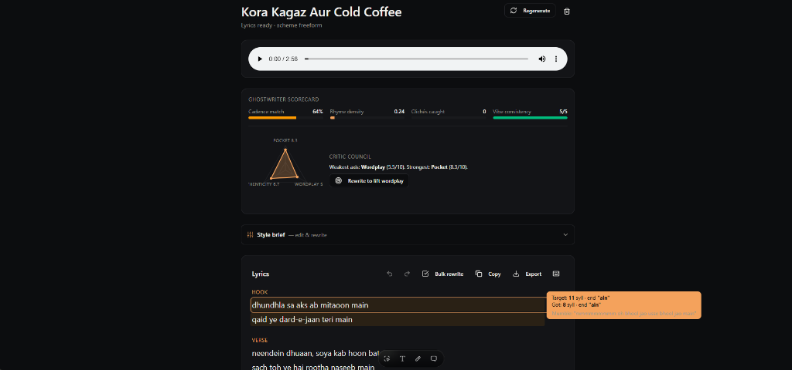
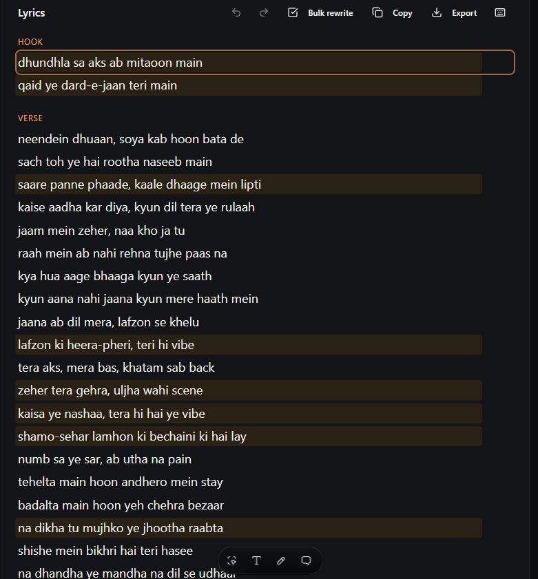

# VibeVox

<p align="center">
  
  
  
  
  
  
</p>

An open-source, local-first studio workspace for vocalists, songwriters, and producers. **VibeVox** turns mumble freestyles and scribbles into Drake/Kendrick/Seedhe Maut/Brodha V-tier polished lyrics, maps audio cadences in real-time, and builds a personalized style memory—all running **100% offline** on your local machine with zero cloud lock-in.

---

## 💡 Inspiration: VoxSketch AI

**VibeVox** is heavily inspired by **[VoxSketch AI](https://voxsketch.com/)**, pioneering the concept of turning raw vocal mumble recordings and spontaneous freestyles into structured, cadence-matched song lyrics.

While cloud-based tools rely on remote APIs and subscription credits, **VibeVox** brings this workflow to the open-source community as a **100% local-first application**. Your audio recordings, vocal takes, and style memory never leave your device.

---

## ✨ Features & Multilingual Intelligence

- ✨ **VibeLyrics Studio & Side-by-Side Notepad**: Distraction-free typable notepad coupled side-by-side with live 6-channel DHH phonetic vision, Matra prosody counting, triplet pocket rolls, micro-caesura breath markers, and compound rhyme bounding boxes.

- 🎙️ **Live Punch-In Studio**: Real-time voice capture with latency-compensated bar slicing, Web Audio oscilloscope waveform, and metronome pulse ring.
- 🧠 **Ghostwriter & Zero-LLM RAG Engine**: Multi-pass cadence matching, anti-cliché burned-phrase filter, and Reciprocal Rank Fusion ($RRF$) hybrid vector recall. Works seamlessly with local LLMs (**LM Studio**, **Ollama**) or **100% Zero-LLM Offline RAG Mode** (POS-grammar cadence assembly via style memory + Indic phonetic rimes) when no LLM is connected.
- ⚡ **Web Worker Pipeline Offloading**: Off-main-thread worker bridge (`pipeline.worker.ts`) keeps the UI thread running smoothly at 60 FPS during heavy multi-pass LLM reasoning and RAG vector scoring.
- 📜 **Virtual Scrolling Bar List**: Integrated `@tanstack/react-virtual` for smooth 60 FPS virtualized rendering of long track bar lists (30+ bars).
- 🕒 **Track Version History & Snapshots**: Persistent snapshots of track lyrics, cadence maps, and briefs with 1-click bar/track level restoration (`src/lib/track-versions.ts`).
- 🔔 **Notification Center Progress Drawer**: Slide-out activity drawer tracking real-time pipeline pass progress, iteration counts, and quality scores across sessions.
- 🎧 **Audio Playback with Bar Sync**: Custom Web Audio player (`AudioPlayer.tsx`) featuring real-time bar timestamp highlighting synchronized to track BPM.
- 🎨 **Metaphor & Imagery Synthesizer**: Pre-generation sensory domain mapping (tactile textures, visual settings, luxury vs street contrasts, and double-entendre wordplay blueprints).
- 🎵 **Pre-Generation Rhyme Ladder Planner**: Pre-plans 2-syllable and 3-syllable multisyllabic rime clusters across 4-bar blocks (AABB, ABAB, AAAA) using custom Indic and English phonetic rime engines.
- 📚 **Multilingual Dictionary Datasets**: Native support for **Romanized Hindi (Hinglish)** and **Romanized Kannada (Kanglish)** with complete 31,021-entry **KEED 2018** Kannada-English dictionary ingestion (`public/data/kannada_lyric_dictionary.json`), Desi Hip-Hop vocabulary blueprints, parts-of-speech annotations, and English meanings.
- 🔒 **100% Offline & Private**: Zero API keys or cloud subscriptions required. Runs on local LLMs (**LM Studio**, **Ollama**) and local STT (**faster-whisper-server**).
- 💾 **Local-First Storage**: Audio takes save to **OPFS** (Origin Private File System); tracks and style memories save to **IndexedDB**. Includes 1-click JSON bundle import/export.
- ⌨️ **Keyboard Shortcuts & Sound FX**: Integrated shortcut system (`?` overlay) and synthesized Web Audio sound FX cues.
- 🕸️ **Knowledge Graph Enabled**: Complete codebase AST indexed with [Graphify](https://github.com/sponsors/safishamsi) for interactive architectural exploration.

---

## 🏗️ End-to-End System Architecture



---

## 📸 Interface Showcase & Visual Tour

Explore the core studios and modules of **VibeVox**:

### 1. Landing Page (`/`)
*Gradient-backed hero section highlighting 100% local-first features and quickstart options.*


### 2. Onboarding Wizard (`/onboarding`)
*3-step setup flow for auto-scanning local LLM/Whisper servers, trying demo recordings, and feature discovery.*


### 3. Track Library (`/library`)
*The central dashboard featuring real-time search, status filter dropdowns, and sort options.*


### 4. New Track Studio (`/new`)
*Create new songs from mumble transcripts, live mic recordings, or uploaded audio files with vocal guidance tips.*


### 5. Live Punch-In Studio (`/live`)
*Real-time vocal capture featuring live oscilloscope waveform visualizer, metronome ring, and bar pocket analysis.*


### 6. Reference & Style Intelligence (`/references`)
*1-click web lyric scraper to extract cadence blueprints (Cadence Fingerprints) and train your AI ghostwriter.*


### 7. Ghostwriter Scorecard & Critic Council
*Multi-pass cadence scorecard, radar chart breakdown (Pocket, Wordplay, Authenticity), Critic Council rewrite suggestions, and real-time syllable target tooltips.*



### 8. Cadence Pocket Grid & Rhyme Scheme Highlighting
*Interactive lyric editor with real-time cadence density highlighting, syllable count matching, and rhyme scheme visualization.*



---

## 📁 Codebase Directory Structure

```
VibeVox
├── data/                               # Dictionary raw assets & PDFs
│   └── KEED_2018-29-971.pdf            # KEED 2018 Kannada-English Dictionary source PDF
├── public/
│   ├── data/                           # Ingested JSON datasets
│   │   ├── kannada_lyric_dictionary.json # 31,021-entry Romanized Kannada dictionary (POS + definitions + rimes)
│   │   └── hindi_lyric_dictionary.json   # Romanized Hindi (Hinglish) rap vocabulary dataset
│   └── screenshots/                    # Interface showcase image assets
├── scripts/
│   └── build_dictionary_datasets.py    # Python ingestion pipeline for KEED 2018 PDF & Hinglish dataset
├── src/
│   ├── components/                     # UI components
│   │   ├── connect/                    # Extracted Connect page scan panels (LlmScanPanel, WhisperScanPanel)
│   │   ├── settings/                   # Extracted Settings panels (StyleTrainingPanel, StyleMemoryPanel)
│   │   ├── track/                      # Extracted Track editor sub-components (BarRow, TrackScorecard, ExportMenu, BulkRewriteBar, TrackToolbar, VirtualizedBarList, VersionHistory, AudioPlayer)
│   │   ├── NotificationCenter.tsx      # Pipeline progress drawer
│   │   ├── PocketGrid.tsx              # Cadence syllable grid & rhyme visualizer
│   │   └── StyleBriefForm.tsx          # Lyric direction & brief controls
│   ├── hooks/                          # Custom React hooks (use-notifications, use-shortcuts, use-live-capture)
│   ├── lib/                            # Core intelligence & persistence layer
│   │   ├── data/                       # Pre-compiled TypeScript dictionary modules
│   │   ├── __tests__/                  # Vitest unit test suite (87/87 tests passing)
│   │   │   ├── artistic-ghostwriter.test.ts
│   │   │   ├── BarRow.test.tsx
│   │   │   ├── cache.test.ts
│   │   │   ├── indic-phonetics.test.ts
│   │   │   ├── local-pipeline.integration.test.ts
│   │   │   ├── local-store.test.ts
│   │   │   ├── offline-rag.test.ts
│   │   │   ├── phonemes.test.ts
│   │   │   ├── PocketGrid.test.tsx
│   │   │   ├── providers.test.ts
│   │   │   ├── style-memory.merge.test.ts
│   │   │   └── style-recall.test.ts
│   │   ├── local-pipeline.ts           # Ghostwriter generation & refinement pipeline
│   │   ├── pipeline.worker.ts          # Off-thread Web Worker pipeline runner
│   │   ├── pipeline-worker-bridge.ts   # Main thread worker bridge
│   │   ├── track-versions.ts           # Persistent track snapshot history
│   │   ├── local-store.ts              # IndexedDB & OPFS local storage manager
│   │   ├── offline-rag-generator.ts    # Zero-LLM Offline POS-Grammar Cadence Engine
│   │   ├── rhymes.ts                   # Dynamic lazy-loaded rhyme providers (Datamuse, CMUdict, Indic)
│   │   └── style-hybrid-rag.ts         # Reciprocal Rank Fusion (RRF) Multi-Level Hybrid RAG
│   └── routes/                         # TanStack Start file-based route handlers
│       ├── __root.tsx
│       ├── _app/                       # Authenticated application surface
│       │   ├── live.tsx                # Live Punch-In studio page
│       │   ├── new.tsx                 # New track studio page
│       │   ├── library.tsx             # Track library dashboard
│       │   ├── references.tsx          # Reference fingerprints page
│       │   ├── settings.tsx            # Settings & LLM configuration
│       │   └── track.$id.tsx           # Track lyrics editor & studio
│       └── onboarding.tsx
├── .commitlintrc.json                  # Conventional commits linting config
├── .env.example                        # Documented environment template
├── graphify-out/                       # Graphify AST Knowledge Graph index
├── start-local.bat                     # Windows 1-click launcher script
└── README.md
```

---

## 🚀 Quickstart

### Option A: Windows 1-Click Launcher (Recommended)
Double-click `start-local.bat` in the project root. It automatically:
1. Runs pre-flight diagnostic checks (Node.js version, missing dependencies).
2. Auto-starts AMD GPU DirectML `faster-whisper-server` (voice transcription) on port `9000`.
3. Opens **[http://localhost:8080](http://localhost:8080)** in your web browser.
4. Starts the local development server.

*To shut down all background AI servers and dev ports cleanly, double-click **`stop-local.bat`**.*

### Option B: Command Line (Cross-Platform)

```bash
# 1. Install dependencies (Bun or NPM)
bun install   # or: npm install

# 2. Start development server
bun dev       # or: npm run dev
```

Open **`http://localhost:8080`** in your browser.

---

## 🤖 Local AI Setup (Optional)

### 1. Local LLM (LM Studio / Ollama)
For offline AI lyric generation and ghostwriter assistance:
- **LM Studio**: Open LM Studio $\rightarrow$ Load a model (e.g., `Qwen2.5-7B` or `Llama-3.2`) $\rightarrow$ Go to **Local Server** tab ($\langle/\rangle$) $\rightarrow$ Click **Start Server** (Port `1234`). Enable **CORS** in settings.
- **Ollama**: Run `ollama pull llama3.1:8b` and start with `OLLAMA_ORIGINS='*' ollama serve`.

### 2. Live Voice Transcription & AMD GPU / Low-RAM Setup
For real-time voice-to-text recording:

#### Option A: Low-RAM Mode (int8) — ~180 MB RAM (CPU / General)
```bash
pip install faster-whisper-server
faster-whisper-server --model tiny.en --compute_type int8 --port 9000
```

#### Option B: AMD Radeon GPU Acceleration (DirectML / Vulkan)
For Windows PCs with AMD Radeon GPUs:
- **DirectML**: `pip install onnxruntime-directml` and launch `faster-whisper-server --device auto --port 9000`.
- **whisper.cpp (Vulkan GPU)**: Build with `-DGGML_VULKAN=ON` and run `./whisper-server -m models/ggml-tiny.en.bin --port 9000 -vulkan`. Operates entirely on AMD GPU shaders with ~150 MB RAM overhead.

---

## 📄 License & Acknowledgments

- **License**: Released under the **MIT License**.
- **Special Thanks**: Inspired by **[VoxSketch AI](https://voxsketch.com/)** for pioneering AI vocal mumble transcription.
- **Dictionaries & Phonetics**: Powered by KEED 2018 Kannada-English Dictionary, Hinglish DHH dataset, CMUdict, Datamuse, and RhymeWave.
